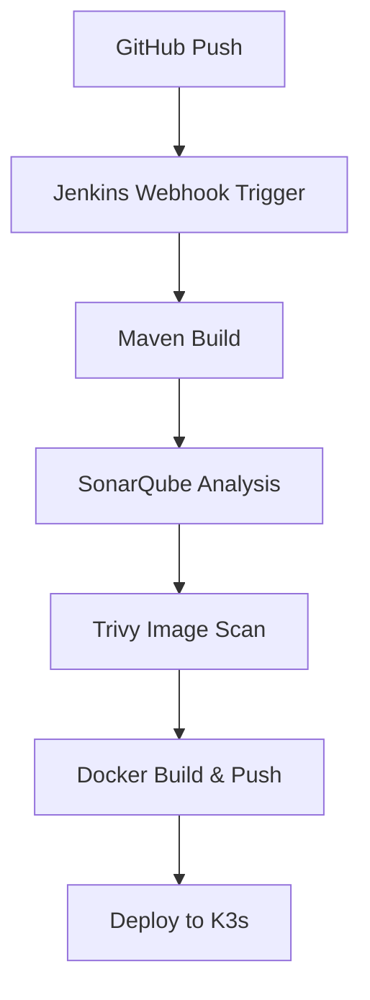

# 🔧 **Step 3: CI/CD Pipeline (Jenkins-based) — Best Practice Edition**

---

## 📊 Architecture Overview



---

## 🧩 Prerequisites on Jenkins EC2 Node

Make sure:

* Jenkins is installed and running
* Jenkins user has access to:

  * `docker`
  * `kubectl`
* Required plugins are installed:

  * ✅ Pipeline
  * ✅ Docker Pipeline
  * ✅ GitHub Integration
  * ✅ SonarQube Scanner
  * ✅ Kubernetes CLI Plugin
* Credentials are created in Jenkins:

  * `dockerhub-creds`: DockerHub username + password
* SonarQube server is configured as `"SonarQube"`

---

## 📁 GitHub Repo Structure

```
spring-app/
├── Jenkinsfile
├── Dockerfile
├── deployment.yaml
├── pom.xml
└── src/
```

---

## 📄 Jenkinsfile (Final Version)

```groovy
pipeline {
  agent any

  environment {
    IMAGE = 'yourdockerhubusername/spring-app'
    TAG = 'latest'
    SONARQUBE_ENV = 'SonarQube'
    DOCKER_CREDENTIALS_ID = 'dockerhub-creds'
  }

  stages {

    stage('Checkout Source Code') {
      steps {
        git 'https://github.com/your-username/spring-app.git'
      }
    }

    stage('Build with Maven') {
      steps {
        sh 'mvn clean package -DskipTests'
      }
    }

    stage('SonarQube Code Analysis') {
      steps {
        withSonarQubeEnv("${SONARQUBE_ENV}") {
          sh 'mvn sonar:sonar'
        }
      }
    }

    stage('Trivy Scan - Source Code') {
      steps {
        sh '''
        trivy fs --exit-code 0 --severity HIGH,CRITICAL . || true
        '''
      }
    }

    stage('Docker Build & Push') {
      steps {
        script {
          docker.withRegistry('', DOCKER_CREDENTIALS_ID) {
            def appImage = docker.build("${IMAGE}:${TAG}")
            appImage.push()
          }
        }
      }
    }

    stage('Trivy Scan - Docker Image') {
      steps {
        sh '''
        trivy image ${IMAGE}:${TAG} || true
        '''
      }
    }

    stage('Deploy to K3s') {
      steps {
        sh 'kubectl apply -f deployment.yaml'
      }
    }
  }

  post {
    success {
      echo '✅ CI/CD Pipeline completed successfully!'
    }
    failure {
      echo '❌ CI/CD Pipeline failed!'
    }
  }
}
```

---

## 📄 Dockerfile (Slim Java Runtime)

```Dockerfile
FROM openjdk:17-jdk-slim
COPY target/*.jar app.jar
ENTRYPOINT ["java", "-jar", "/app.jar"]
```

---

## 📄 deployment.yaml (K3s-Compatible)

```yaml
apiVersion: apps/v1
kind: Deployment
metadata:
  name: spring-app
spec:
  replicas: 1
  selector:
    matchLabels:
      app: spring-app
  template:
    metadata:
      labels:
        app: spring-app
    spec:
      containers:
        - name: spring-app
          image: yourdockerhubusername/spring-app:latest
          ports:
            - containerPort: 8080
---
apiVersion: v1
kind: Service
metadata:
  name: spring-app-service
spec:
  type: NodePort
  selector:
    app: spring-app
  ports:
    - port: 8080
      targetPort: 8080
      nodePort: 30080
```

---

## 🔐 Jenkins Setup Summary

| Configuration      | Value                            |
| ------------------ | -------------------------------- |
| Docker Credentials | `dockerhub-creds`                |
| SonarQube Name     | `SonarQube`                      |
| Docker Access      | `jenkins` user in `docker` group |
| Kubectl Access     | Preconfigured via Ansible        |

---

## 🌐 Service Access URLs

| Service      | URL                     |
| ------------ | ----------------------- |
| Jenkins      | `http://<EC2-IP>:8080`  |
| SonarQube    | `http://<EC2-IP>:9000`  |
| Grafana      | `http://<EC2-IP>:3000`  |
| Prometheus   | `http://<EC2-IP>:9090`  |
| Deployed App | `http://<EC2-IP>:30080` |

---

## ✅ Outcome

This Jenkins pipeline gives you a full **DevSecOps CI/CD flow**, featuring:

* Continuous Integration via **Maven**
* Continuous Security with **SonarQube** and **Trivy**
* Continuous Delivery with **Docker + K3s**
* Lightweight, production-ready on a **single EC2 instance**

---

## ✅ Add Notifications to Jenkins Pipeline

---

### 🛠 Option A: **Slack Notifications**

#### 1. 🔌 Install Slack Plugin

On your Jenkins server:

* Go to `Manage Jenkins` → `Manage Plugins`
* Install: **Slack Notification Plugin**

---

#### 2. 🔧 Configure Slack in Jenkins

* Go to `Manage Jenkins` → `Configure System`
* Scroll to **Slack** section
* Add:

  * **Workspace**: Connect to your Slack workspace
  * **Credential**: Slack token (via App/Bot)
  * **Default Channel**: `#devsecops-alerts` (or your desired channel)
  * Click **Test Connection**

---

#### 3. 📄 Update Jenkinsfile (Slack)

Add this to the **top** of your pipeline block:

```groovy
options {
  slackNotifier(true)
}
```

Then add Slack notification to the `post` section:

```groovy
post {
  success {
    slackSend(channel: '#devsecops-alerts', message: "✅ Pipeline Succeeded: ${env.JOB_NAME} [${env.BUILD_NUMBER}]")
  }
  failure {
    slackSend(channel: '#devsecops-alerts', message: "❌ Pipeline Failed: ${env.JOB_NAME} [${env.BUILD_NUMBER}]")
  }
}
```

---

### 📨 Option B: **Email Notifications**

#### 1. 🔌 Install Email Extension Plugin

* Go to `Manage Jenkins` → `Manage Plugins`
* Install: **Email Extension Plugin**

---

#### 2. 🔧 Configure Mail Server

* Go to `Manage Jenkins` → `Configure System`
* Scroll to **Extended E-mail Notification**

  * SMTP Server: `smtp.gmail.com` (example)
  * Use SSL: ✅
  * SMTP Port: `465`
  * SMTP Auth: ✅
  * Username: `your-email@gmail.com`
  * Password: App Password (not regular password)
* Set **Default Recipients**: `devops-team@example.com`

---

#### 3. 📄 Update Jenkinsfile (Email)

Add this to the `post` block of your pipeline:

```groovy
post {
  success {
    emailext (
      subject: "✅ Jenkins Build Success: ${env.JOB_NAME} #${env.BUILD_NUMBER}",
      body: "Great news! Your pipeline completed successfully.",
      to: "devops-team@example.com"
    )
  }
  failure {
    emailext (
      subject: "❌ Jenkins Build Failed: ${env.JOB_NAME} #${env.BUILD_NUMBER}",
      body: "Oops! Your pipeline failed. Please investigate.",
      to: "devops-team@example.com"
    )
  }
}
```

---

## 🔐 Sensitive Info

* For **Slack**, you need a **Slack App** with bot permissions and OAuth token
* For **Email**, use an **App Password** (not personal Gmail password)

---

## 🧪 Test Before Production

* Run a simple dummy pipeline to verify Slack/email sends correctly
* Ensure Jenkins has **internet access** to reach Slack/email APIs

---

### ✅ Result

You now get real-time alerts for pipeline **success** and **failure** directly in:

* 🔔 Slack channel (`#devsecops-alerts`)
* ✉️ Email inbox (`devops-team@example.com`)

---
