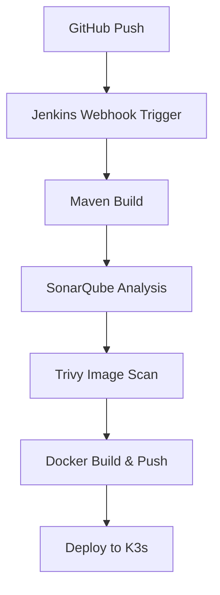

# 🔧 CI/CD Pipeline Architecture (Within Jenkins)

### 🔄 Jenkins Stages



---

## ✅ Prerequisites on Jenkins Server (EC2)

Ensure:

* Jenkins is installed and running.
* Docker is available (we already set this up in Ansible).
* Jenkins user can run `docker` and `kubectl`.
* Jenkins has the following plugins installed:

  * **Pipeline**
  * **Docker Pipeline**
  * **GitHub Integration**
  * **SonarQube Scanner**
  * **Kubernetes CLI Plugin**
  * **Trivy (optional script stage)**

---

## 📁 Sample Java App Repo Structure (`spring-boot` assumed)

```
spring-app/
├── src/
├── pom.xml
├── Jenkinsfile
├── Dockerfile
├── deployment.yaml
```

---

## 📄 Sample `Dockerfile`

```Dockerfile
FROM openjdk:17-jdk-alpine
COPY target/app.jar app.jar
ENTRYPOINT ["java", "-jar", "/app.jar"]
```

---

## 📄 Sample `deployment.yaml` (K3s-ready)

```yaml
apiVersion: apps/v1
kind: Deployment
metadata:
  name: spring-app
spec:
  replicas: 1
  selector:
    matchLabels:
      app: spring-app
  template:
    metadata:
      labels:
        app: spring-app
    spec:
      containers:
      - name: spring-app
        image: <your-dockerhub-username>/spring-app:latest
        ports:
        - containerPort: 8080
---
apiVersion: v1
kind: Service
metadata:
  name: spring-app-service
spec:
  type: NodePort
  selector:
    app: spring-app
  ports:
    - port: 8080
      targetPort: 8080
      nodePort: 30080
```

---

## 📄 Jenkinsfile (Declarative Pipeline)

```groovy
pipeline {
  agent any

  environment {
    DOCKER_IMAGE = "your-dockerhub-username/spring-app:latest"
    SONARQUBE_SERVER = "SonarQube"
    DOCKER_CREDENTIALS_ID = "dockerhub-creds"
  }

  stages {
    stage('Checkout') {
      steps {
        git 'https://github.com/your-username/spring-app.git'
      }
    }

    stage('Build with Maven') {
      steps {
        sh 'mvn clean package -DskipTests'
      }
    }

    stage('SonarQube Analysis') {
      steps {
        withSonarQubeEnv('SonarQube') {
          sh 'mvn sonar:sonar'
        }
      }
    }

    stage('Trivy Scan') {
      steps {
        sh 'trivy fs --exit-code 0 --severity HIGH,CRITICAL . || true'
      }
    }

    stage('Docker Build & Push') {
      steps {
        script {
          docker.withRegistry('', DOCKER_CREDENTIALS_ID) {
            def img = docker.build(DOCKER_IMAGE)
            img.push()
          }
        }
      }
    }

    stage('Deploy to K3s') {
      steps {
        sh '''
        kubectl apply -f deployment.yaml
        '''
      }
    }
  }

  post {
    success {
      echo "✅ Deployment completed!"
    }
    failure {
      echo "❌ Pipeline failed"
    }
  }
}
```

---

## 🔐 Jenkins Credentials Setup

Go to: `Jenkins > Manage Jenkins > Credentials` and add:

* **DockerHub credentials**: ID = `dockerhub-creds`
* Optional: **GitHub token** if private repo

---

## 🔧 Jenkins Configuration: SonarQube

* Go to: `Manage Jenkins > Configure System`
* Add SonarQube server with Name = `"SonarQube"`

---

## 🌐 Access Services (Ports Opened in Terraform)

| Service    | URL                     |
| ---------- | ----------------------- |
| Jenkins    | `http://<EC2-IP>:8080`  |
| SonarQube  | `http://<EC2-IP>:9000`  |
| Grafana    | `http://<EC2-IP>:3000`  |
| Prometheus | `http://<EC2-IP>:9090`  |
| App (K3s)  | `http://<EC2-IP>:30080` |

---
