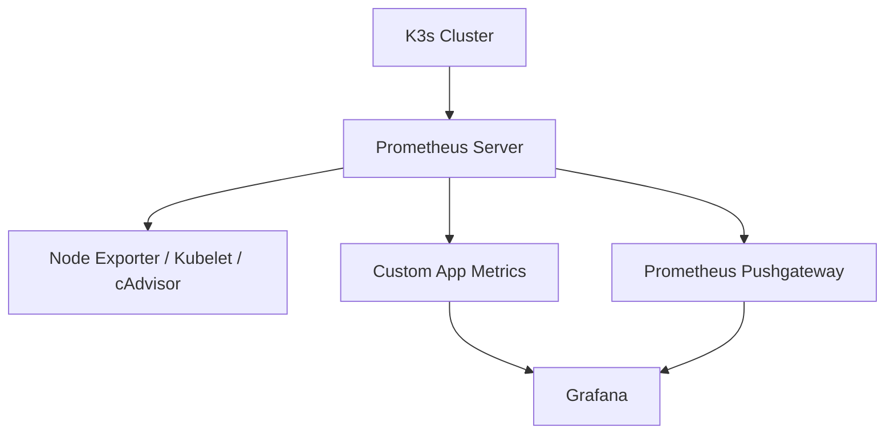

# 🔧 Monitoring Architecture Overview



---

## ✅ Step-by-Step Setup on the Same EC2 (via Ansible or manually)

### 🔹 1. Install Prometheus

Create a basic Prometheus config (`prometheus.yml`):

```yaml
global:
  scrape_interval: 15s

scrape_configs:
  - job_name: 'kubernetes'
    kubernetes_sd_configs:
      - role: node
    relabel_configs:
      - action: labelmap
        regex: __meta_kubernetes_node_label_(.+)

  - job_name: 'kubernetes-pods'
    kubernetes_sd_configs:
      - role: pod
    relabel_configs:
      - source_labels: [__meta_kubernetes_pod_annotation_prometheus_io_scrape]
        action: keep
        regex: true
      - source_labels: [__meta_kubernetes_pod_annotation_prometheus_io_path]
        action: replace
        target_label: __metrics_path__
        regex: (.+)
      - source_labels: [__address__, __meta_kubernetes_pod_annotation_prometheus_io_port]
        action: replace
        regex: (.+):(?:\d+);(\d+)
        replacement: $1:$2
        target_label: __address__
```

> 🧠 This uses Kubernetes service discovery to find pods/metrics.

**Install Prometheus via K3s (Helm or kubectl)**:

```bash
kubectl create namespace monitoring

helm repo add prometheus-community https://prometheus-community.github.io/helm-charts
helm repo update

helm install prometheus prometheus-community/prometheus \
  --namespace monitoring
```

---

### 🔹 2. Install Grafana

**Install with Helm:**

```bash
helm install grafana grafana/grafana \
  --namespace monitoring \
  --set adminPassword='admin123' \
  --set service.type=NodePort \
  --set service.nodePort=30000
```

> 📌 Grafana will be available at `http://<EC2-IP>:30000`

---

### 🔹 3. Configure Grafana

* Login with `admin/admin123`
* Add **Prometheus** as a **Data Source** (`http://prometheus.monitoring.svc.cluster.local:9090`)
* Import a Kubernetes dashboard:

  * **Dashboard ID:** `315` (Kubernetes Cluster Monitoring)
  * Or explore dashboards on [https://grafana.com/grafana/dashboards](https://grafana.com/grafana/dashboards)

---

### 🔹 4. Optional: Expose Metrics in Your App

In your Spring Boot app:

```xml
<!-- pom.xml -->
<dependency>
  <groupId>io.micrometer</groupId>
  <artifactId>micrometer-registry-prometheus</artifactId>
</dependency>
```

Expose metrics at:

```
http://<POD-IP>:8080/actuator/prometheus
```

And in Prometheus config, add scrape for this path.

---

## 🔐 Exposed Monitoring Endpoints

| Service    | Port    | URL                     |
| ---------- | ------- | ----------------------- |
| Grafana    | 30000   | `http://<EC2-IP>:30000` |
| Prometheus | default | `http://<EC2-IP>:9090`  |

---

## 🚨 Alerts (Optional, Next Step)

Prometheus supports **alerting rules** + **Alertmanager** → send to Slack, email, etc.

---

## 📦 Summary: What’s Running Where

* **Jenkins** on port `8080` (CI/CD)
* **SonarQube** on port `9000` (Static Analysis)
* **Grafana** on `30000` (Dashboards)
* **Prometheus** (Internal service)
* **K3s** manages and monitors all apps + infra

---
